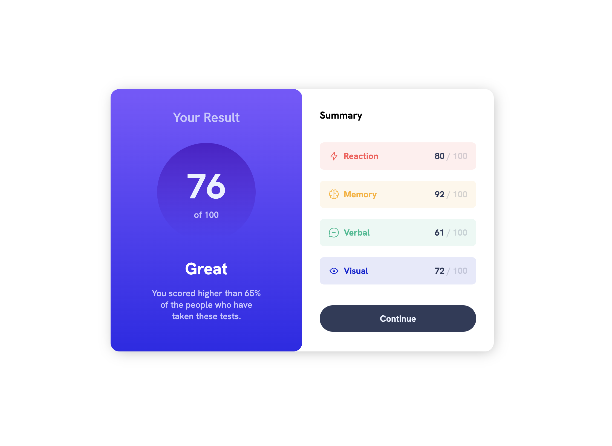

  <svg width="84" height="84" viewBox="0 0 24 24" fill="none" xmlns="http://www.w3.org/2000/svg">
    <path d="M16 9H19L14 16M10 9H14L12 17M5 9H8L10 16M15 4H17L19 7H16M11 4H13L14 7H10M7 4H9L8 7H5M6 2L2 8L12 22L22 8L18 2H6Z" fill="#9747FF"/>
  </svg>

  <h1>Results Summary</h1>
  
<em>This project is strongly inspired by Frontentmemtor's challeges</em>

 

## About the Project 
 

 
 
This project was done to help me get started with my basic knowledge and implement it to develop a basic Product's card to reinforce the knowledge developed in my short life as a student of various basic technologies in the web developer Frontend. 
 
 

## Built 👷🏼‍♂️

The technologies and tools used to develop this website are: 
 

* Tools:
    * VScode
    * Chrome
    * Git

 

* Languages:
    * HTML
    * CSS

## Inspiration 🔗

As I said this page is inspired by the Frontentmentor challenge where I have practiced with several challenges that I detail below: with their respective links.

 

### This Challenge:
* 🔗 Link: https://achipre.github.io/results-summary-component
* 📦 Repository: https://github.com/achipre/results-summary-component
* 💎 FrontendMentor: https://www.frontendmentor.io/challenges/results-summary-component-CE_K6s0maV

### Other Frontentmemtor's challeges:

#### 1) Product Preview

* 🔗 Link: https://achipre.github.io/product-preview-basic
* 📦 Repository: https://github.com/achipre/product-preview-basic
* 💎 FrontendMentor: https://www.frontendmentor.io/challenges/product-preview-card-component-GO7UmttRfa

#### 2) Landing Page

* 🔗 Link: https://achipre.github.io/landing-page-basic
* 📦 Repository: https://github.com/achipre/landing-page-basic
* 💎 FrontendMentor: https://www.frontendmentor.io/challenges/skilled-elearning-landing-page-S1ObDrZ8q